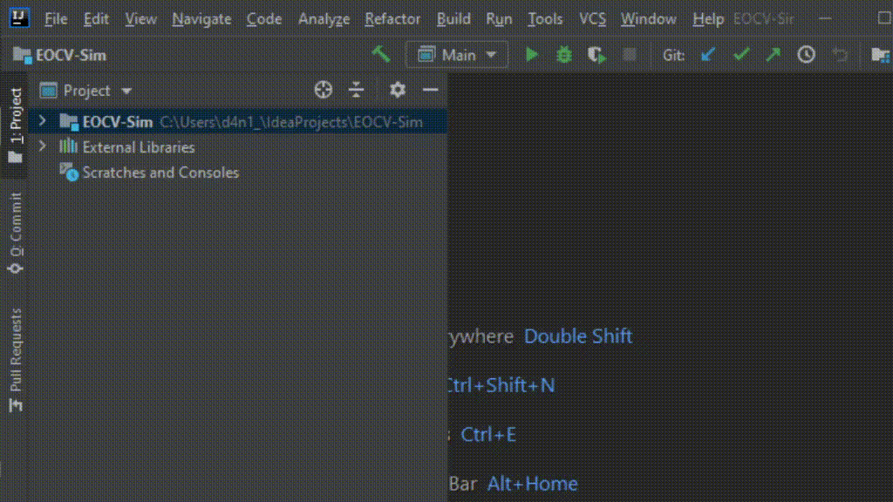

# Welcome!

EOCV-Sim (EasyOpenCV Simulator) is a straightforward way to test your pipelines in a 
simple user interface directly in your computer, simulating entirely the EasyOpenCV library & the 
FTC SDK structure, allowing you to simply copy paste directly your pipeline code once you want to 
transfer it onto your robot!


# Installation

No complicated setup is required, straight up importing the project into IntelliJ IDEA:

1) **Download & install the Java Development Kit if you haven't already:**<br/><br/>
      JDK 13 is the most tested with the Sim, but any JDK > 8 will probably work fine.<br/>
      You can download JDK > 8 from [the Oracle webpage](https://www.oracle.com/java/technologies/javase-downloads.html)<br/>
      **Since JDK 13 seems unavailable on the Oracle site, you can alternatively use JDK 14 or 11**<br/><br/>
      Here is a [step by step video](https://www.youtube.com/watch?v=IJ-PJbvJBGs) of the JDK installation process<br/>

2) **Download & install IntelliJ IDEA Community IDE if you haven't already:**<br/><br/>
      You can download it from the JetBrains webpage (https://www.jetbrains.com/idea/download/)<br/>
      Here is another great [step by step video](https://www.youtube.com/watch?v=E2okEJIbUYs) for IntelliJ installation.
     
3) **Clone and import the project:**<br/>

      1) Open IntelliJ IDEA and in the main page click on "Get from Version Control"<br/>
      
            <br/><br/>
         Alternatively, if you already had another project opened, go to File > New > Project from Version Control...<br/><br/>
            
            
      2) Another window will show up for cloning and importing a repository into IntelliJ<br/>
      
         1) In the "URL" field, enter: ```https://github.com/serivesmejia/EOCV-Sim.git```<br/>
         2) The directory can be changed, but it will be automatically filled so it's not necessary.
         3) Make sure the "Version control" is set to "Git".<br/><br/>
         <br/>
         4) After that, click on the "Clone" button, located at the bottom right and the cloning process will begin...<br/>    
         <br/>
         5) After the cloning finishes, the project should automatically import and you'll have something like this:<br/><br/>
            <br/>
            
4) **Change to packages view** (optional):<br/><br/>
      In order to have a better look of your project's sources, I recommend to change the view to "project" as explained next:<br/>
      1) Go to the left where your project files are shown, and click on the "Project" drop down list
      2) Select "Packages" from the list and the view will change.<br/><br/>
      Here's a quick gif illustrating these steps:<br/><br/>
      <br/><br/>
### And you're ready to go! Make sure to read the [usage documentation](https://github.com/serivesmejia/EOCV-Sim/edit/master/USAGE.md) to learn more about how to use the simulator<br/>

# Contact information<br/>
For any quick troubleshooting or help, you can find me on Discord as *serivesmejia#8247* and on the FTC discord server. I'll be happy to assist you in any issue you might have :)<br/><br/>
For bug reporting or feature requesting, use the [issues tab](https://github.com/serivesmejia/EOCV-Sim/issues) in this repository.
