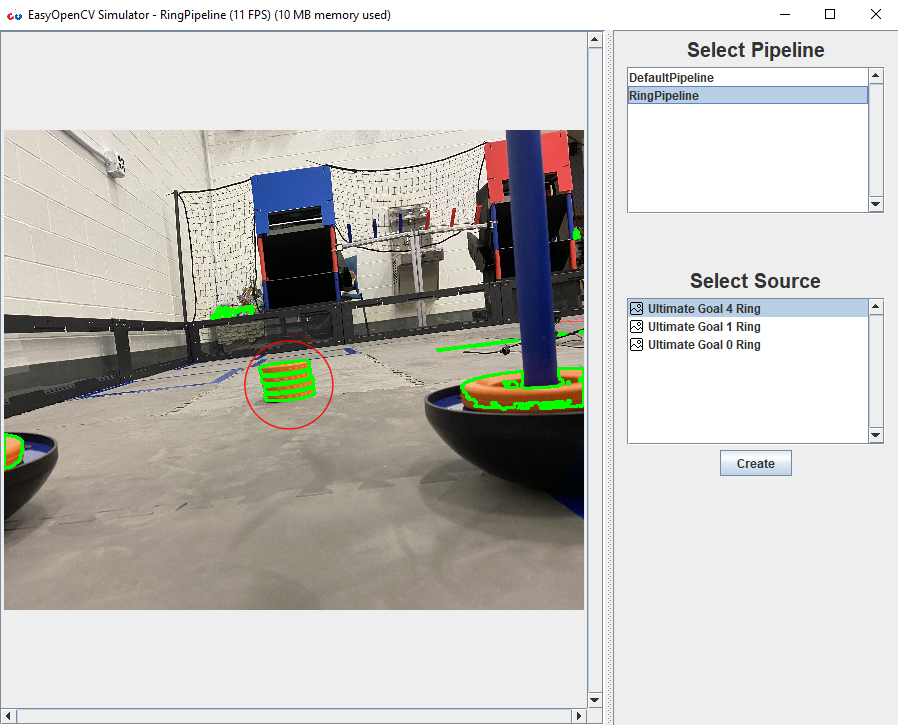
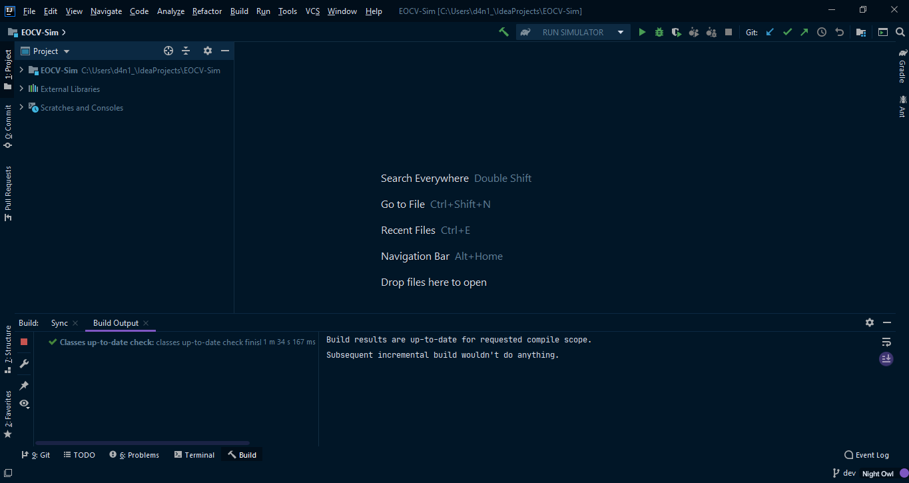

[](https://jitpack.io/#serivesmejia/EOCV-Sim)
[](https://repl.it/github/serivesmejia/EOCV-Sim)


# Welcome!

EOCV-Sim (EasyOpenCV Simulator) is a straightforward way to test your pipelines in a 
simple user interface directly in your computer, simulating the EasyOpenCV library & 
FTC SDK structure, allowing you to simply copy paste directly your pipeline code once you want to 
transfer it onto your robot!



Because OpenCV in Java uses a native library, which are platform specific, the simulator is currently limited to the following platforms:

* Windows x64 (tested)
* Windows x32 (untested)
* MacOS x64 (tested)
* Linux x64 (tested for Ubuntu 20.04)<br/>

# Installation

## Recommended installation method

No complicated setup is required, straight up importing the project into IntelliJ IDEA:

1) **Download & install the Java Development Kit if you haven't already:**<br/><br/>
      JDK 9 is the minimum required one, although it's not available for download so any JDK above that version will probably work fine.<br/>
      You can download it from [the Oracle webpage](https://www.oracle.com/java/technologies/javase-downloads.html),
      and here is a [step by step video](https://www.youtube.com/watch?v=IJ-PJbvJBGs) of the installation process<br/>

2) **Download & install IntelliJ IDEA Community IDE if you haven't already:**<br/><br/>
      You can download it from the JetBrains webpage (https://www.jetbrains.com/idea/download/)<br/>
      Here is another great [step by step video](https://www.youtube.com/watch?v=E2okEJIbUYs) for IntelliJ installation.
     
3) **Clone and import the project:**<br/>

      1) Open IntelliJ IDEA and in the main screen click on "Get from Version Control"<br/>
      
            <br/><br/>
         Alternatively, if you already had another project opened, go to File > New > Project from Version Control...<br/><br/>
            
            
      2) Another window will show up for cloning and importing a repository into IntelliJ<br/>
      
         1) In the "URL" field, enter: ```https://github.com/serivesmejia/EOCV-Sim.git```<br/>
         2) The directory can be changed, but it will be automatically filled so it's not necessary.
         3) Make sure the "Version control" is set to "Git".<br/><br/>
         <br/>
         4) After that, click on the "Clone" button, located at the bottom right and the cloning process will begin...<br/>    
         <br/>
         5) After the cloning finishes, the project should automatically import and you'll have something like this:<br/><br/>
            <br/>
            
### And you're ready to go! Refer to the [usage explanation](https://github.com/serivesmejia/EOCV-Sim/blob/master/USAGE.md) for further details on how to utilize the simulator.<br/>

## From the command-line

   1) Clone EOCV-Sim repo and cd to the cloned folder
   
	 git clone https://github.com/serivesmejia/EOCV-Sim.git
	 cd EOCV-Sim	
   \**Or it can also be manually downloaded as a ZIP file from GitHub*<br/>

   2) Run EOCV-Sim through gradle:
  
	 gradlew runSim
	 
   \**On some command lines (like Windows PowerShell) you might need to execute "./gradlew" instead*<br/>
	 
#### And that's it! You might need to wait a bit for gradle to download all the dependencies but EOCV-Sim will open eventually.
	 
## From repl.it

   1) Click [here](https://repl.it/github/serivesmejia/EOCV-Sim) to go to repl.it, you might require to create an account if you haven't already. Once you do that, it will automatically create a new project and start cloning the EOCV-Sim repo.
 
   2) After the cloning is finished, click on the green "Run" button at the top and EOCV-Sim should start.
  
   \**Please note that this method is not widely supported and you might run into some issues or lack of some functionality.*<br/>
	 
	
## Adding EOCV-Sim as a dependency

   ### Gradle
   ```groovy
   repositories {
       maven { url 'https://jitpack.com' } //add jitpack as a maven repo 
   }
   
   dependencies {
      implementation 'com.github.serivesmejia:EOCV-Sim:2.0.2' //add the EOCV-Sim dependency
   }
   ```
   
   ## Maven
   
   Adding the jitpack maven repo
   ```xml
    <repositories>
		<repository>
		    <id>jitpack.io</id>
		    <url>https://jitpack.io</url>
		</repository>
	</repositories>
   ```
   
   Adding the EOCV-Sim dependecy
   ```xml
    <dependency>
	    <groupId>com.github.serivesmejia</groupId>
	    <artifactId>EOCV-Sim</artifactId>
	    <version>2.0.2</version>
	</dependency>
   ```

# Contact
For any quick troubleshooting or help, you can find me on Discord as *serivesmejia#8237* and on the FTC discord server. I'll be happy to assist you in any issue you might have :)<br/><br/>
For bug reporting or feature requesting, use the [issues tab](https://github.com/serivesmejia/EOCV-Sim/issues) in this repository.

# Change logs

### [v2.0.2 - TaskBar hotfix](https://github.com/serivesmejia/EOCV-Sim/releases/tag/v2.0.2)
      
  - This is the 5th release for EOCV-Sim.
      
      - Bugfixes:
        
        - Fixes UnsupportedOperationException with the TaskBar API in some operating system
            
### [v2.0.1 - BooleanField hotfix](https://github.com/serivesmejia/EOCV-Sim/releases/tag/v2.0.1)
      
  - This is the 4th release for EOCV-Sim.

      - Bugfixes:
      
        - Fixes ArrayIndexOutOfBoundsException when initial value of a boolean field was true which would make the sim enter into a frozen state.

### [v2.0.0 - Major Update](https://github.com/serivesmejia/EOCV-Sim/releases/tag/v2.0.0)
      
 - This is the 3rd release for EOCV-Sim.

      - Changelog:
      
      	- Gradle is now used as the main build system
        - Added variable tuner for public non-final supported fields in the pipeline, accessible on the bottom part of the image viewport.
        - Pipeline pause and resume option to save resources, pauses automatically with image sources for one-shot analysis
        - Top Menu bar containing new features/convenient shortcuts:
          - Save Mat to disk option in File submenu
          - Restart feature in File submenu
          - Shortcut for creating input sources under File -> New -> Input Source
          - Settings menu under Edit submenu
          - "About" information screen under Help submenu
          - Appereance themes via the FlatLaf library, selectable in the settings window
        - Telemetry now is passed to the pipeline via the constructor rather than an instance variable, check usage explaination for further details
        - Mat visualizing into the viewport is now handled in another thread to improve performance
        - Pipeline FPS are now capped at 30
        - Zooming viewport is now supported, using mouse wheel while holding Ctrl key
        
      - Bugfixes:
        
        - Removed call to the gc in the main loop due to performance issues
        - Fixed BufferedImage mem leak by recycling previously used buffered images and trying to flush them
        - Some internal code cleaning & reestructuration
        - Fixed issues with native lib loading (mostly on Mac) with the OpenCV package provided by OpenPnP
     
### [v1.1.0 - Telemetry Update](https://github.com/serivesmejia/EOCV-Sim/releases/tag/v1.1.0)
      
 - This is the 2rd release for EOCV-Sim.
      
      - Changelog:

        - Added a Telemetry implementation displayed in the UI. Replicates the FTC SDK one, it can be used directly in pipelines.
        - Added an option to define the CameraSource resolution when creation.
        - Added MacOS support (thnx Noah)
        - Changed default resolution to 320x280 everywhere since it is the most commonly used in EOCV
        - Native libs are now downloaded by the simulator from another GitHub repo to avoid bloating the repository with heavy files
        - Java libraries, such as classgraph, opencv and gson are now delivered in compiled jars to improve compile times
       
      - Bug fixes:
       
        - Fixed a bug where the InputSources would return a BGR Mat instead of RGB, which is the type EOCV gives.
        - Regarding the last point, the visualizer now expects for the given mats to be RGB
        - Improved general IO error handling everywhere, from file accessing to input sources reading, so that the simulator doesn’t enter in a freeze state if any IO related operation fails
        - Improved multi threading handling for changing pipelines and inputsources.
        - Fixed issue in Linux where the buttons would be moved to an incorrect position when resizing out and then trying to resize back to the original size
 
 
### [v1.0.0 - Initial Release](https://github.com/serivesmejia/EOCV-Sim/releases/tag/v1.0.0)
      
 - Initial EOCV-Sim release.
      
