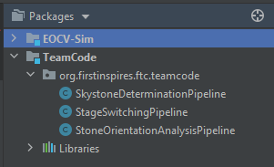
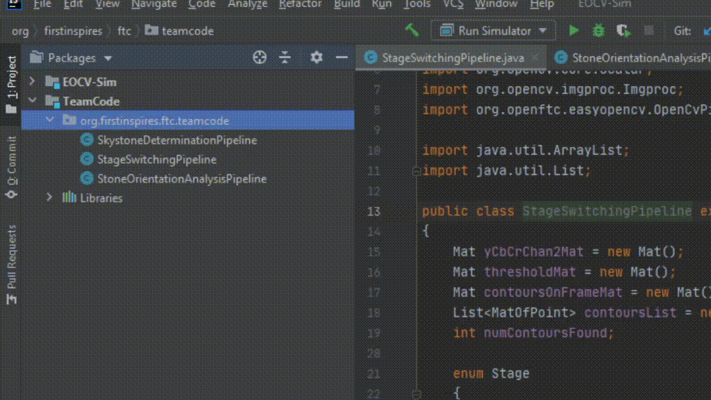

# Usage Explaination

### This guide is still a work in progress 

The purpose of this software is to *simulate the package & class structure of OpenFTC's EasyOpenCV and a little bit of the FTC SDK*,
while also providing OpenCV functionality and a simple GUI. By simulating the aforementioned structure, it allows the imports, class names, etc.
to be the same as they would if you were using the FTC SDK with EasyOpenCV, allowing you to simply copy paste your vision code
onto your Android Studio project once you want to transfer it to a robot.<br/>

## Table of Contents
- Pipelines
    - Sample Pipeline
- Input Sources

## Popping out the TeamCode module

EOCV-Sim uses Gradle since v2.0.0, because of this, the project structure is a bit different. For finding the package in which the pipelines have to be placed:</br>
1) Pop out the parent EOCV-Sim project folder by clicking on the horizontal arrow
2) Find the TeamCode module (folder) and pop it out just like before
3) Find the src folder and open it
4) Now you will find the *org.firstinspires.ftc.teamcode* package, in which some sample pipelines are already placed.

These steps are illustrated in this gif:</br>

<br/>

## Pipelines

As said before, all of the pipeline classes **should be** placed under the *org.firstinspires.ftc.teamcode* package, in the *TeamCode* module. This way, they will be
automatically detected by the simulator and will be selectionable from the GUI.

<br/>

*(Also, the simulator already comes by default with some EasyOpenCV samples)*<br/>

To create a new java class, follow these steps:<br/>
1) In the project files menu, open the TeamCode module
2) Find the *org.firstinspires.ftc.teamcode* package and right click on it
3) On the context menu, click on *New > Java Class*
4) A new menu will appear, type a name and make sure the *Class* option is selected
5) Once you have typed a name, press enter and the class will be created

Here's a quick gif illustrating these steps:<br/>

<br/>

If you want your class to be a pipeline, it **should also** extend the EOCV's OpenCvPipeline abstract class and override the processFrame() method.<br/><br/>
Here's a empty pipeline template, with the SamplePipeline class we created before:

```java
package org.firstinspires.ftc.teamcode;

import org.opencv.core.Mat;
import org.openftc.easyopencv.OpenCvPipeline;

public class SamplePipeline extends OpenCvPipeline {

    @Override
    public void init(Mat input) {
        /* Executed once, when the pipeline is selected */
    }

    @Override
    public Mat processFrame(Mat input) {
        /* Executed each frame, the returned mat will be the one displayed */
        /* Processing and detection stuff */
        return input; // Return the input mat
                      // (Or a new, processed mat)
    }

    @Override
    public void onViewportTapped() {
        /*
         * Executed everytime when the pipeline view is tapped/clicked.
         * This is executed from the UI thread, so whatever we do here
         * we must do it quickly.
         */
    }

}
```

### For more detailed information about pipelines, make sure to check out the [EasyOpenCV docs](https://github.com/OpenFTC/EasyOpenCV/blob/master/doc/user_docs/pipelines_overview.md)

## Input Sources

To allow multiple ways to test your pipeline, the simulator comes with so called *Input Sources*, which are the ones in charge of giving your pipeline the input Mats, As of right now, the sim has two types of Input Sources:

- Image Source:</br></br>
    These will feed your pipeline with a static Mat from an image loaded in your computer hard drive.</br>
    To save resources, your pipeline will just run once when you select an image source, but you can optionally resume the pipeline execution by clicking the           "Pause" button under the pipeline selector.</br></br>
- Camera Source:</br></br>
    These will feed your pipeline with a constantly changing Mat from a specified camera plugged in your computer.</br>
    Unlike the image sources, these will not pause the execution of you pipeline by default, but you can click the "Pause" button to pause it at any time.
    
### Creating an Input Source

    1) 

## Telemetry

There's also an SDK-like Telemetry implementation in the sim. 
In 1.1.0 (when it was introduced) you could simply access it from your pipeline since it was an instance variable ```telemetry```.

But, starting 2.0.0, to make it more alike to an actual EOCV pipeline, you need to implement a public constructor which takes a Telemetry parameter, then creating and setting an instance variable from that constructor:

```java
package org.firstinspires.ftc.teamcode;

import org.opencv.core.Mat;
import org.openftc.easyopencv.OpenCvPipeline;

import org.firstinspires.ftc.robotcore.external.Telemetry;

public class TelemetryPipeline extends OpenCvPipeline {

    Telemetry telemetry;

    public TelemetryPipeline(Telemetry telemetry) {
        this.telemetry = telemetry;
    }

    @Override
    public Mat processFrame(Mat input) {
        telemetry.addData("[Hello]", "World!");
        telemetry.update();
        return input; // Return the input mat
    }

}
```

Which then produces the following result:<br/>

<br/>

For further information about telemetry, you can check out the [SDK docs on Telemetry](https://ftctechnh.github.io/ftc_app/doc/javadoc/org/firstinspires/ftc/robotcore/external/Telemetry.html), note that not all the methods are implemented for EOCV-Sim

# Variable Tuner

From 2.0.0, there's a variable tuner implemented into the simulator, inspired by the one in FTC Dashboard, it allows to edit variables in real time seamlessly through Java reflection.
